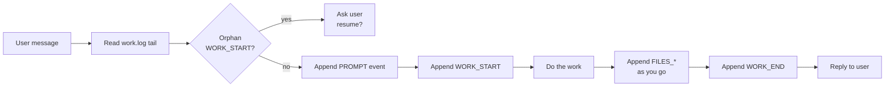
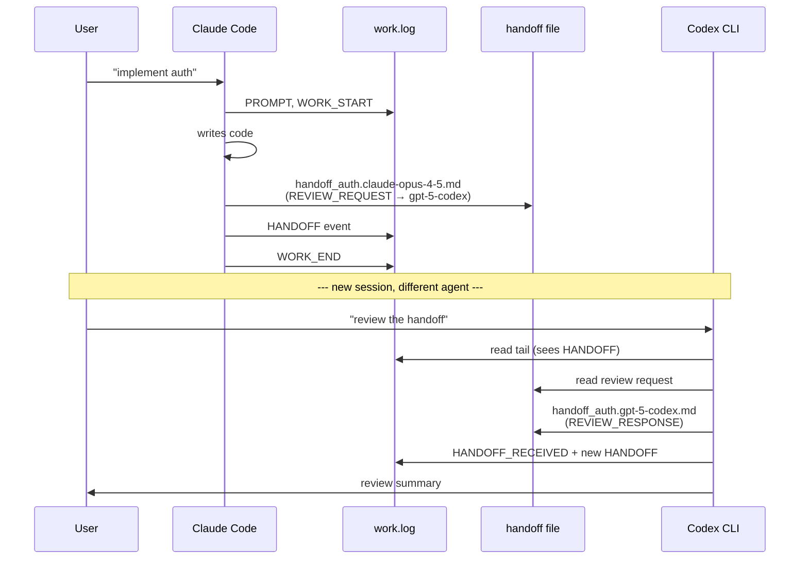

# agent-work-mem

> A vendor-neutral, file-based collaboration protocol that lets multiple AI coding agents — Claude Code, ChatGPT Codex CLI, OpenCode, Antigravity, Cursor, Aider, Cline, Continue, Windsurf, gemini-cli — share state, hand off work, and resume across sessions, models, and machines. Nothing but markdown in your project.

[](LICENSE)
[]()

---

## What is this?

If you've ever felt any of these:

- An AI agent forgets what it did 30 minutes ago after `/compact`.
- You hand work between Claude and GPT and they trample each other's edits.
- A new session has no idea what the previous session decided.
- "Did the agent run the tests, or just say it did?" — no audit trail.
- You want to use Cursor for one task and Claude Code for another on the same project, and have them coordinate.

**agent-work-mem** is a 1-prompt install that fixes all of this. It establishes a tiny protocol — two markdown files in your project — that every AI agent reads at session start and writes to as it works. The result: persistent shared memory across any combination of agents, vendors, and machines.

It's just markdown. No daemon, no database, no SaaS. Your existing AI agent does all the work — you just paste a prompt once.

---

## How it works

Two files in your project:

```
your-project/
├── (your code)
└── AIMemory/
    ├── PROTOCOL.md         ← the rules (every agent reads this)
    ├── work.log            ← append-only shared event log
    ├── handoff_*.md        ← cross-agent messages (AICP)
    └── *.md                ← any other agent-authored notes
```

Every agent, on every turn, follows a fixed discipline:



When agents need to coordinate, they write **AICP handoff files**:



Each event in `work.log` carries the agent's identity and capabilities:

```
### 2026-04-26 14:30 | claude-opus-4-5 | PROJECT_BOOTSTRAPPED
Vendor: Anthropic
Harness: Claude Code
Capabilities: filesystem-read, filesystem-write, shell-exec, web-fetch, web-search
Strengths: long-context reasoning + code synthesis
Context: 200000

### 2026-04-26 15:10 | gpt-5-codex | RE_ENGAGED
Vendor: OpenAI
Harness: ChatGPT Codex CLI
Capabilities: filesystem-read, filesystem-write, shell-exec, code-sandbox
Strengths: tight code completion, agentic coding loop
Context: 200000

### 2026-04-26 15:11 | gpt-5-codex | HANDOFF_RECEIVED
← claude-opus-4-5: handoff_auth.claude-opus-4-5.md
Acknowledged. Replying in handoff_auth.gpt-5-codex.md.
```

The capability declaration is **vendor-neutral** — agents speak `filesystem-write`, not `Bash` or `WriteFile`. Any agent can read another's record and know what it could do.

---

## Installation

### Step 1 — Open your AI agent in your project directory

Compatible with any agentic LLM platform:

| Agent platform        | Underlying model(s)                  |
|-----------------------|--------------------------------------|
| Claude Code           | Claude Opus / Sonnet / Haiku         |
| ChatGPT Codex (CLI)   | GPT-5 / GPT-5-Codex                  |
| OpenCode              | any (via provider config)            |
| Antigravity           | Gemini family                        |
| Cursor (agent mode)   | Claude / GPT / Gemini                |
| Aider                 | any (via provider config)            |
| Cline / Continue      | any (via provider config)            |
| Windsurf              | proprietary + others                 |
| Codex CLI / gemini-cli| GPT-5-Codex / Gemini-2.5-Pro         |

### Step 2 — Paste [`prompt.md`](prompt.md) into your first session

The agent will:

1. State its identity (model-id, vendor, harness, capabilities)
2. Detect your OS
3. Create `AIMemory/PROTOCOL.md` and `AIMemory/work.log`
4. Append a `PROJECT_BOOTSTRAPPED` event
5. Optionally detect/install Obsidian for visual log browsing
6. Commit to following the protocol on every subsequent turn

That's it. From this point on, every agent on this project follows the same rules.

### Step 3 — For every later session, paste this short reminder

```
This project uses the AIMemory protocol. Read AIMemory/PROTOCOL.md and the
last 50 lines of AIMemory/work.log before processing my request. State
your model-id and capabilities, then proceed.
```

Or — better — put this in the agent's permanent system prompt:

- **Claude Code**: append to `CLAUDE.md` at project root
- **Cursor**: add to `.cursorrules`
- **Aider**: add to `.aider.conf.yml` `read:` list
- **ChatGPT Codex CLI**: `.codex/instructions.md` or equivalent
- **Custom GPT** / Claude Project: paste into the system instructions

After that, every new session auto-reads the protocol — you don't paste anything.

---

## Usage

### Multi-agent handoff (the AICP layer)

When agent A wants agent B to act on something — review a spec, take over a task, answer a question — A creates a structured handoff file:

```markdown
# Auth implementation review

**From**: claude-opus-4-5
**From-vendor**: Anthropic
**To**: gpt-5-codex
**Date**: 2026-04-26 14:30
**Type**: REVIEW_REQUEST
**Priority**: NORMAL
**Reply by**: when convenient
**Re**: src/auth/jwt.ts (commit a3f2b1)
**Required capability**: none

## Summary
Implemented JWT auth with refresh tokens. Want a second pair of eyes on
the rotation logic before merging.

## Context
[...]

## Review checklist (for AI-B)
- [ ] Token rotation race conditions
- [ ] Refresh token revocation flow
- [ ] HTTP-only cookie configuration
```

Agent B (in a separate session) reads `work.log`, finds the `HANDOFF` event, opens the handoff file, and writes a `REVIEW_RESPONSE` reply with action items checked. Both events are tracked in `work.log` for audit. See [examples/](examples/) for full samples.

### Recovering from session loss (`/compact`, model swap, machine reboot)

1. Open a new session in the project.
2. Paste the short reminder.
3. Agent reads `work.log` tail → sees the last 20–50 events → knows exactly where you left off.
4. Agent checks for orphan `WORK_START` (work that started but didn't `WORK_END`).
5. If found, agent asks: "Previous task '<X>' didn't finish. Resume, or start fresh?"

Average resume time: **under 60 seconds**, regardless of how long ago you stopped.

### Multi-machine work (cloud-synced AIMemory)

If `AIMemory/` lives on Dropbox / iCloud / Google Drive, switch to **per-session log files** to avoid sync conflicts:

```
AIMemory/
├── PROTOCOL.md
├── work.log              (legacy / digest)
└── sessions/
    ├── 2026-04-26T14-30__claude-opus-4-5__claude-code.log
    ├── 2026-04-26T14-32__gpt-5-codex__chatgpt-codex-cli.log
    └── 2026-04-26T15-10__gemini-2-5-pro__antigravity.log
```

Each session writes to its own file. Reading agents merge them on the fly:

```bash
cat AIMemory/sessions/*.log | grep -E '^### ' | sort | tail -50
```

The protocol detects this mode automatically — if `AIMemory/sessions/` exists, agents use it. If not, they share `work.log`.

### Optional: Obsidian for visual browsing

The bootstrap prompt offers to install [Obsidian](https://obsidian.md) and instructs you to open `AIMemory/` as a vault. Recommended community plugins:

- **Dataview** — query `work.log` events as a table (e.g. "all open WORK_STARTs")
- **Templater** — pre-fill new handoff files with the AICP header
- **Calendar** — daily activity view

Sample Dataview query for a dashboard note:

````markdown
```dataview
TABLE WITHOUT ID From, To, Type, Priority, file.link AS "Handoff"
FROM ""
WHERE startswith(file.name, "handoff_")
  AND !contains(file.content, "HANDOFF_CLOSED")
SORT file.mtime DESC
```
````

→ All open handoffs in one table, automatically.

---

## Cautions

- **Append-only — never edit `work.log` mid-stream.** The protocol uses POSIX `O_APPEND` atomicity for race safety; read-modify-write tools break this guarantee. If you must correct an earlier entry, append a `CORRECTION` event referencing the original timestamp.
- **Keep events under 4 KB.** POSIX guarantees atomic appends only at this size. If your event body is longer, split: write the bulk into a separate `AIMemory/<slug>.<model-id>.md` file and put a short event in `work.log` linking to it.
- **Cloud-synced AIMemory needs per-session files.** Sync layers (Dropbox, iCloud, Google Drive, OneDrive) will produce conflict copies if multiple machines write to the same `work.log`. Use the per-session mode (see above).
- **Some agents don't reliably know their own model version.** They should ask the user instead of guessing. Wrong model-id pollutes the log permanently.
- **`AIMemory/` may contain sensitive info.** Conversations, design notes, internal decisions. If your repo is public, either:
  - keep `AIMemory/` in a private repo, or
  - audit before commit, or
  - gitignore `AIMemory/` and back it up separately.
- **Don't put secrets in `work.log`.** API keys, tokens, passwords — never. Use env vars + reference them by name only.
- **The protocol is a convention, not enforcement.** A misbehaving agent can still skip the rules. The remedy is a one-line nudge ("you forgot to append WORK_END") — same as code review.

---

## Benefits

| Benefit | Why it matters |
|---------|----------------|
| **Cross-vendor** | Works with Anthropic, OpenAI, Google, xAI, Mistral, DeepSeek, Qwen, Meta, … — generic capability vocabulary, no vendor lock-in. |
| **Cross-harness** | Same project: Claude Code today, Cursor tomorrow, Codex CLI on the laptop. All share state. |
| **Cross-session** | Survives `/compact`, model swaps, crashed sessions, reboots. New session reads `work.log` tail and is current in 60 seconds. |
| **Cross-machine** | Per-session file mode handles Dropbox/iCloud sync without conflicts. |
| **Race-safe** | POSIX `O_APPEND` atomicity baseline + optional `flock` + per-session fallback. Tiered defense, no silent corruption. |
| **Auditable** | Every action is logged. "Did the agent run the tests?" — grep `work.log`. |
| **Markdown-native** | Works with Obsidian, any text editor, git, grep. No special tooling required. |
| **Zero install** | One paste of `prompt.md`. No daemon, no SaaS, no API key. |
| **Capability-aware handoffs** | Receiving agent sees `Required capability` in handoff header and can refuse with `BLOCKER_RAISED` instead of failing silently. |
| **Self-documenting** | Each `PROJECT_BOOTSTRAPPED` declares vendor + tools + strengths in vendor-neutral tags. Future readers can see what each session could do. |

---

## Examples

### Real scenarios

**Scenario 1 — Claude writes, GPT reviews**

1. Claude writes auth code, creates `handoff_auth.claude-opus-4-5.md` (REVIEW_REQUEST), logs HANDOFF.
2. User opens Codex CLI: "review the handoff".
3. Codex reads `work.log` tail, finds HANDOFF, opens the file, writes `handoff_auth.gpt-5-codex.md` (REVIEW_RESPONSE).
4. Claude session resumes the next day — sees the review immediately.

**Scenario 2 — `/compact` recovery**

1. New Claude session.
2. `read AIMemory/work.log tail` → sees last task + open handoffs.
3. Last `RE_ENGAGED` shows previous session had `web-search` capability — current session doesn't. Either uses cached info or hands off.
4. Orphan `WORK_START`? → ask user about resumption.

**Scenario 3 — Capability mismatch caught early**

1. Gemini analyzes a PDF (multimodal capability) → STATUS_REPORT with `Required capability: image-input`.
2. Claude sees the handoff but lacks `image-input`. Reads the text summary instead of attempting the PDF directly. Logs `Capability used: text-only`.
3. Future session knows: "if I need to re-analyze the PDF, route to Gemini."

**Scenario 4 — Two agents, same machine, concurrent**

1. User has Claude Code + Codex CLI open in two terminals.
2. Both follow PROTOCOL.md §6.1 (single heredoc, ≤4KB events) → POSIX `O_APPEND` atomicity prevents byte interleaving.
3. Each agent reads tail before write — if the other has an open `WORK_START`, append a `NOTE` flagging concurrent work.
4. After the dust settles, `work.log` interleaves their events in real time order. Markers make it human-readable.

**Scenario 5 — Multi-machine via Dropbox**

1. Desktop Claude Code session → writes to `AIMemory/sessions/2026-04-26T14-30__claude-opus-4-5__claude-code.log`.
2. Laptop Cursor session → writes to `AIMemory/sessions/2026-04-26T14-32__claude-opus-4-5__cursor.log`.
3. Each owns its own file → zero sync conflict.
4. Either machine merges via `cat AIMemory/sessions/*.log | sort` for unified history.

See [`examples/`](examples/) for full file samples.

---

## Chat-only LLM fallback

This protocol is designed for **agentic** LLMs (filesystem + shell access). If you want occasional input from a chat-only LLM (web ChatGPT free, Gemini chat, mobile apps):

- Don't try to bootstrap with the chat-only LLM — it can't write files.
- Instead: use an agentic LLM to bootstrap, then for chat-only consultations, paste the relevant `work.log` excerpt + handoff file as context, and ask for a review.
- The chat-only LLM's response goes back through the agentic LLM, which logs it as a NOTE event.

In practice, chat-only LLMs are best for one-shot opinions, not as protocol participants.

---

## Architecture in one screen

```
┌──────────────────────────────────────────────────────────┐
│                    your-project/                         │
│                                                          │
│  src/                          AIMemory/                 │
│  ├── ...                       ├── PROTOCOL.md           │
│  └── ...                       ├── work.log              │
│                                ├── handoff_*.md          │
│                                └── *.md (notes)          │
└──────────────────────────────────────────────────────────┘
              ▲                          ▲
              │                          │
   ┌──────────┴──────────┐    ┌──────────┴──────────┐
   │    Claude Code      │    │   ChatGPT Codex CLI │
   │  claude-opus-4-5    │    │     gpt-5-codex     │
   │ filesystem-write,   │    │ filesystem-write,   │
   │ shell-exec, ...     │    │ shell-exec, ...     │
   └─────────────────────┘    └─────────────────────┘
              ▲                          ▲
              │                          │
              └──────── User ────────────┘
                  (any agent works,
                   any time, any machine)
```

---

## License

MIT — do whatever, attribution appreciated.

## Contributing

Issues + PRs welcome. The protocol is intentionally minimal; if you propose an addition, please show:

1. The concrete pain point that motivates it.
2. Why it can't be solved with an existing event type or convention.
3. Backward compatibility — older `work.log` files must still parse.

## Credits

Distilled from real multi-AI shipping projects (Anthropic + OpenAI + Google agents collaborating on the same codebase). Names withheld; the protocol is the deliverable.
