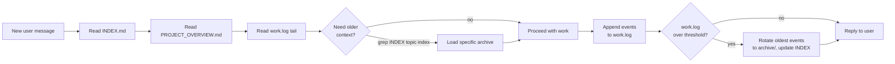
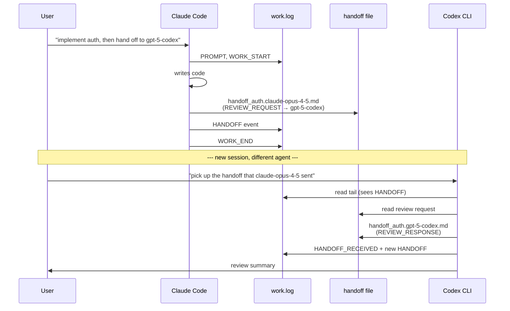

# agent-work-mem

[Korean README](README.ko.md)

> A vendor-neutral, file-based collaboration protocol that lets multiple AI coding agents — Claude Code, ChatGPT Codex CLI, OpenCode, Antigravity, Cursor, Aider, Cline, Continue, Windsurf, gemini-cli — share state, hand off work, and resume across sessions, models, and machines. Nothing but markdown in your project.

[](LICENSE)
[]()
[]()

---

## Quick start

Using several AI coding agents is powerful, but the context handoff is painful: copy-pasting summaries, repeating decisions, losing track of who ran what.

`agent-work-mem` gives your project one shared working memory. Any agent can read it, write to it, and hand work off to another agent.

### Language policy

All operational prompt surfaces installed by `agent-work-mem` are English-only: `prompt.md`, `PROTOCOL.md`, `upgrade.md`, optional `tmux-handoff.md`, and generated protocol templates. Localized README files are human documentation only and are not copied into `AIMemory/` or loaded as protocol prompts. User-provided text in logs and handoffs is preserved verbatim.

### Install in one prompt

Open any agent in your project directory and say:

```text
Fetch https://raw.githubusercontent.com/daystar7777/agent-work-mem/main/prompt.md and apply it to this project.
```

Or, in plain language:

```text
Install daystar7777/agent-work-mem into this project.
```

The agent will create an `AIMemory/` folder and set up the shared memory protocol.

### Start another agent

After installation, open any other agent and say:

```text
Read the project structure and AIMemory, then tell me you understand the current state.
```

That agent will read `AIMemory/INDEX.md`, `AIMemory/PROJECT_OVERVIEW.md`, and `AIMemory/work.log` before working.

### Hand off work

Ask the sending agent:

```text
Hand this off to Codex for implementation.
```

Then ask the receiving agent:

```text
Review the handoff and execute it.
```

All prompts, decisions, actions, tests, and handoffs are recorded in plain markdown, especially `AIMemory/work.log`.

Works with Claude, Codex, Cursor, Antigravity, Aider, Cline, Continue, Windsurf, gemini-cli, and any agent that can read and write files.

---

## What is this?

If you've ever felt any of these:

- An AI agent forgets what it did 30 minutes ago after `/compact`.
- You hand work between Claude and GPT and they trample each other's edits.
- A new session has no idea what the previous session decided.
- "Did the agent run the tests, or just say it did?" — no audit trail.
- After a few days the AIMemory folder is so big that just reading it bloats LLM context.
- A new LLM joining the project has no quick way to understand what's going on.

**agent-work-mem** is a 1-prompt install that fixes all of this. It establishes a small protocol — a few markdown files in your project — that every AI agent reads at session start and writes to as it works. Result: persistent shared memory across any combination of agents, vendors, and machines, with **tiered storage** so old context doesn't bloat new sessions.

It's just markdown. No daemon, no database, no SaaS. Your existing AI agent does all the work — you just point it at this repo and say "apply".

---

## How it works

A few files in your project's `AIMemory/` folder:

```
your-project/
├── (your code)
└── AIMemory/
    ├── INDEX.md            ← file inventory + topic search index (read FIRST)
    ├── PROJECT_OVERVIEW.md ← onboarding primer for any new LLM (read SECOND)
    ├── PROTOCOL.md         ← the rules (every agent reads this once on bootstrap)
    ├── tmux-handoff.md     ← optional lazy tmux pane delivery extension (tmux only)
    ├── work.log            ← append-only HOT event log (last ~50 events)
    ├── archive/            ← WARM tier — older events grouped by date
    │   └── work-YYYY-MM-DD.log
    ├── cold/               ← COLD tier — period digests (on-demand)
    │   └── digest-YYYY-MM.md
    ├── handoff_*.md        ← cross-agent messages (AICP)
    └── *.md                ← any other agent-authored notes
```

Every agent, on every turn, follows a fixed reading order:



When agents need to coordinate, they write **AICP handoff files**:



Each event in `work.log` carries the agent's identity and capabilities (vendor-neutral tags):

```
### 2026-04-26 14:30 | claude-opus-4-5 | PROJECT_BOOTSTRAPPED
Vendor: Anthropic
Harness: Claude Code
Capabilities: filesystem-read, filesystem-write, shell-exec, web-fetch, web-search
Strengths: long-context reasoning + code synthesis
Context: 200000

### 2026-04-26 15:11 | gpt-5-codex | HANDOFF_RECEIVED
← claude-opus-4-5: handoff_auth.claude-opus-4-5.md
Acknowledged. Replying in handoff_auth.gpt-5-codex.md.
```

Any agent can read another agent's record and know what it could do — no vendor-specific tool names like `Bash` or `WriteFile`, just generic capabilities like `filesystem-write`, `shell-exec`, `web-search`.

---

## Installation

### Option A — One-line URL install (recommended, easiest)

In your project directory, open any agentic LLM (Claude Code, ChatGPT Codex CLI, OpenCode, Antigravity, Cursor, Aider, etc.) and tell it:

> Fetch <https://raw.githubusercontent.com/daystar7777/agent-work-mem/main/prompt.md> and apply it to this project.

The agent will WebFetch the prompt and execute the bootstrap steps automatically. Done in one minute.

### Option B — Paste the prompt manually

If your agent doesn't have web fetch, copy the contents of [`prompt.md`](prompt.md) and paste it into your first session. Same result; one extra step.

### Option C — Existing user upgrading from v1 (flat layout)

If you already used an earlier version of agent-work-mem (just `PROTOCOL.md` + `work.log`, no `INDEX.md` / `PROJECT_OVERVIEW.md` / `archive/` / `cold/`), tell your agent:

> Fetch <https://raw.githubusercontent.com/daystar7777/agent-work-mem/main/upgrade.md> and execute it on this project.

The upgrade is non-destructive — your existing `work.log` is preserved. The agent adds the missing files, synthesizes `PROJECT_OVERVIEW.md` from your existing log, and rotates if needed.

### What the bootstrap does

1. The agent declares its identity (model-id, vendor, harness, capabilities)
2. Detects your OS (for the optional Obsidian step)
3. Creates the `AIMemory/` directory tree (`archive/`, `cold/`)
4. Writes `PROTOCOL.md`, `work.log`, `INDEX.md`, `PROJECT_OVERVIEW.md`
5. Appends a `PROJECT_BOOTSTRAPPED` event with its capabilities
6. Optionally detects/installs Obsidian (with your consent) for visual log browsing
7. Commits to following the protocol on every later turn

| Compatible agent platform | Underlying model(s)                  |
|---------------------------|--------------------------------------|
| Claude Code               | Claude Opus / Sonnet / Haiku         |
| ChatGPT Codex (CLI)       | GPT-5 / GPT-5-Codex                  |
| OpenCode                  | any (via provider config)            |
| Antigravity               | Gemini family                        |
| Cursor (agent mode)       | Claude / GPT / Gemini                |
| Aider                     | any (via provider config)            |
| Cline / Continue          | any (via provider config)            |
| Windsurf                  | proprietary + others                 |
| Codex CLI / gemini-cli    | GPT-5-Codex / Gemini-2.5-Pro         |

### Persistent reminder for later sessions

For every new session in this project, the agent should auto-read the protocol. The cleanest way is to put this short reminder in the agent's permanent system prompt:

```
This project uses the AIMemory protocol. Read AIMemory/INDEX.md,
AIMemory/PROJECT_OVERVIEW.md, and the last 50 lines of AIMemory/work.log
before processing my request. State your model-id and capabilities, then
proceed.
```

Where to put it:

- **Claude Code**: append to `CLAUDE.md` at project root
- **Cursor**: add to `.cursorrules`
- **Aider**: add to `.aider.conf.yml` `read:` list
- **ChatGPT Codex CLI**: `.codex/instructions.md`
- **Custom GPT** / Claude Project: paste into the system instructions

After that, every new session auto-reads the protocol — you don't paste anything.

---

## Usage

### Multi-agent handoff — the natural phrasings

The handoff system is the most powerful feature. The phrasings that work in practice:

**To the sending agent:**

> "When you finish, hand this off to `gpt-5-codex` for review."
> "Prepare a handoff for `gpt-5-codex` so it can continue from here."

The agent will create `AIMemory/handoff_<topic>.<your-model>.md` with a structured AICP header and log a `HANDOFF` event in `work.log`.

**To the receiving agent (in a separate session):**

> "Pick up the handoff that `claude-opus-4-5` sent and review it."
> "Review the latest open handoff and continue the work."

The receiving agent reads `work.log`, finds the open HANDOFF event, opens the handoff file, and writes a `REVIEW_RESPONSE` reply with action items.

**This is the actual usage pattern.** You don't need to know AICP message types or write the handoff file by hand — natural-language instructions trigger the structured machinery underneath.

See [`examples/handoff_auth-review.claude-opus-4-5.sample.md`](examples/handoff_auth-review.claude-opus-4-5.sample.md) and the matching response for full sample files.

### tmux direct handoff — optional, lazy-loaded

If both agents are running in the same tmux server, you can ask the sender
to deliver the AICP handoff directly to a named pane:

> "Create the handoff, then deliver it to tmux pane `codex-review`."
> "When done, send the report handoff back to my source pane."

This still writes the normal `AIMemory/handoff_*.md` file and `work.log`
events first. tmux is only a local delivery shortcut that pastes an
agent-facing instruction into the target pane.

The pasted instruction changes with the work you ask the target pane to
do. For example:

> "Hand off the current design to tmux pane `gemini`; have it implement the design, then send a report handoff back."
> "Hand off the current design to tmux pane `gemini` for consistency review, then send a report handoff back."
> "Ask tmux pane `gemini` to inspect the current implementation, test and validate it, fix confirmed issues, then send a report handoff back."

The sender records the matching receiver roles in the handoff and pasted
tmux prompt: `IMPLEMENT`, `REVIEW`, `INSPECT`, `TEST`, `VERIFY`, `FIX`,
or `GENERAL_STATUS`. Roles can be combined, such as
`INSPECT+TEST+VERIFY+FIX`. `REVIEW` means checking consistency,
alignment, or correctness; `INSPECT` means a deeper pass that also
includes improvement opportunities. If the requested receiver role is
ambiguous, the sender asks before delivering. English and localized
natural-language requests are both first-class inputs for this role
inference.

The tmux instructions are lazy-loaded: non-tmux sessions do not read or
install them. Say `tmux handoff on` to make the agent check whether the
current session is inside tmux and load `tmux-handoff.md` only if that
check passes. The command is case-insensitive after trimming surrounding
whitespace. Inside tmux, `prompt.md` may then fetch `tmux-handoff.md`
into `AIMemory/tmux-handoff.md`; outside tmux it leaves that file absent. A
receiving pane shows a small ASCII thumb-up when it accepts the handoff
and again when it completes and sends a `STATUS_REPORT` or
`REVIEW_RESPONSE` handoff back.

Say `tmux handoff off` to disable tmux handoff for the current agent
session. After that, the agent treats any loaded tmux handoff instructions
as inactive context, does not run tmux checks, and handles future handoffs
through normal AICP only, even if a target mentions `tmux-pane:<name-or-id>`.
It does not delete a cached `AIMemory/tmux-handoff.md`; say
`tmux handoff on` again to re-enable it.

For reliable routing, give panes stable titles:

```bash
tmux select-pane -T codex-review
```

You can also ask the current agent to name its own pane:

> "Rename this tmux pane to `codex-review`."
> "Set the current pane name to `codex-review`."

Inside tmux, the agent should store the stable name in the pane-local
`@awm_pane_name` option, run `tmux select-pane -T <name>` for compatibility,
and enable top pane-border titles for the current window. The border uses
`@awm_pane_name` before falling back to `#{pane_title}`, so shell/editor
title changes do not replace the displayed AIMemory pane name. This is
local tmux UI state: it does not create handoff files or write `work.log`
entries unless you explicitly ask to record it.

English and localized natural-language requests should both work. If the
name is quoted, the agent uses the quoted text exactly; otherwise it uses
the final explicit name phrase and asks again if the name is ambiguous.

For the smallest transport test, use the high-five flow:

> "Send a high-five to tmux pane `codex-pane`; return `HIGHFIVE_CONFIRMED` to my source pane."

The sender finds the named pane, pastes a high-five prompt, and asks that
pane to return the configured confirmation phrase to the source pane. The
receiver prints the ASCII high-five with `Sent by: <source pane>` below it,
and the source pane prints the same ASCII with `Sent by: <returning pane>`
after the return prompt arrives. This smoke test does not create handoff
files or write `work.log` entries; it only checks tmux pane lookup and
round-trip prompt delivery.

### Recovering from session loss (`/compact`, model swap, machine reboot)

1. Open a new session in the project.
2. Paste the short reminder (or rely on your system-prompt setup).
3. Agent reads `INDEX.md` → `PROJECT_OVERVIEW.md` → `work.log` tail → knows exactly where you left off.
4. Agent checks for orphan `WORK_START` (work that started but didn't `WORK_END`).
5. If found, agent asks: "Previous task '<X>' didn't finish. Resume, or start fresh?"

Average resume time: **under 60 seconds**, regardless of how long ago you stopped.

### Searching old work

Need to find when something happened? Don't read every archive file — `grep` the topic index in `INDEX.md`:

```bash
grep -i "auth" AIMemory/INDEX.md
# → archive/work-2026-04-26.log appears in the topic index
# load only that file; skip the rest.
```

The agent does this automatically when you ask "did we discuss X before?" — it greps INDEX, identifies the relevant warm/cold files, and loads only those.

### Keeping context small (the tiering system)

When `work.log` exceeds the threshold (default 50 events × 1.5 = 75 events), the next agent that starts a turn rotates the oldest events to `AIMemory/archive/work-YYYY-MM-DD.log` and updates `INDEX.md` with the new archive's date range, event count, and topic keywords.

The user-tunable knob is the first line of `INDEX.md`:

```markdown
## Configuration
- HOT_RETENTION_EVENTS: 50    # change this to 30 / 100 / etc.
```

| Project type                       | Recommended |
|------------------------------------|-------------|
| Active multi-agent (≥3 agents/day) | 30          |
| Standard (default)                 | 50          |
| Long-running solo                  | 100         |

Cold digests (multi-week summaries in `cold/`) are heavyweight — they only happen on explicit user request: "summarize last month into a cold digest". After a cold digest is written, the agent updates `PROJECT_OVERVIEW.md` so the project's onboarding primer always reflects the latest decisions.

### Multi-machine work (cloud-synced AIMemory)

If `AIMemory/` lives on Dropbox / iCloud / Google Drive, switch to **per-session log files** to avoid sync conflicts:

```
AIMemory/
├── PROTOCOL.md
├── INDEX.md
├── PROJECT_OVERVIEW.md
├── work.log              (legacy / digest)
└── sessions/
    ├── 2026-04-26T14-30__claude-opus-4-5__claude-code.log
    ├── 2026-04-26T14-32__gpt-5-codex__chatgpt-codex-cli.log
    └── 2026-04-26T15-10__gemini-2-5-pro__antigravity.log
```

Each session writes to its own file. The protocol detects this mode automatically.

### Optional: Obsidian for visual browsing

The bootstrap prompt offers to install [Obsidian](https://obsidian.md) and instructs you to open `AIMemory/` as a vault. Recommended community plugins:

- **Dataview** — query `work.log` events as a table (e.g. "all open WORK_STARTs")
- **Templater** — pre-fill new handoff files with the AICP header
- **Calendar** — daily activity view

Sample Dataview query for a dashboard note:

````markdown
```dataview
TABLE WITHOUT ID From, To, Type, Priority, file.link AS "Handoff"
FROM ""
WHERE startswith(file.name, "handoff_")
  AND !contains(file.content, "HANDOFF_CLOSED")
SORT file.mtime DESC
```
````

→ All open handoffs in one table, automatically.

---

## Cautions

- **Append-only — never edit `work.log` mid-stream.** The protocol uses POSIX `O_APPEND` atomicity for race safety; read-modify-write tools break this guarantee. The one exception is rotation, which atomically replaces `work.log` (write to temp file + rename).
- **Keep events under 4 KB.** POSIX guarantees atomic appends only at this size. If your event body is longer, split: write the bulk into a separate `AIMemory/<slug>.<model-id>.md` file and put a short event in `work.log` linking to it.
- **Cloud-synced AIMemory needs per-session files.** Sync layers (Dropbox, iCloud, Google Drive, OneDrive) will produce conflict copies if multiple machines write to the same `work.log`. Use the per-session mode above.
- **Some agents don't reliably know their own model version.** They should ask the user instead of guessing. Wrong model-id pollutes the log permanently.
- **`AIMemory/` may contain sensitive info.** Conversations, design notes, internal decisions. If your repo is public, either: keep `AIMemory/` in a private repo, or audit before commit, or gitignore `AIMemory/` and back it up separately.
- **Don't put secrets in `work.log`.** API keys, tokens, passwords — never. Use env vars + reference them by name only.
- **The protocol is a convention, not enforcement.** A misbehaving agent can still skip the rules. The remedy is a one-line nudge ("you forgot to append WORK_END") — same as code review.

---

## Benefits

| Benefit | Why it matters |
|---------|----------------|
| **Cross-vendor** | Works with Anthropic, OpenAI, Google, xAI, Mistral, DeepSeek, Qwen, Meta — generic capability vocabulary, no vendor lock-in. |
| **Cross-harness** | Same project: Claude Code today, Cursor tomorrow, Codex CLI on the laptop. All share state. |
| **Cross-session** | Survives `/compact`, model swaps, crashed sessions, reboots. New session reads `INDEX.md` + `PROJECT_OVERVIEW.md` + tail and is current in 60 seconds. |
| **Cross-machine** | Per-session file mode handles Dropbox/iCloud sync without conflicts. |
| **Tiered storage** | Old context goes to warm archives + cold digests; hot context stays small. New sessions don't drown in old logs. |
| **Searchable history** | `grep` the Topic index in `INDEX.md` to find which archive covers a topic. No reading everything. |
| **Onboarding primer** | `PROJECT_OVERVIEW.md` is the 60-second briefing for any new LLM joining mid-project. |
| **Race-safe** | POSIX `O_APPEND` atomicity baseline + optional `flock` + per-session fallback. Tiered defense, no silent corruption. |
| **Auditable** | Every action is logged. "Did the agent run the tests?" — grep `work.log`. |
| **Markdown-native** | Works with Obsidian, any text editor, git, grep. No special tooling required. |
| **Zero install** | One-line URL install (`Fetch <url> and apply`) with any web-capable agent. |
| **Capability-aware handoffs** | Receiving agent sees `Required capability` in handoff header and can refuse with `BLOCKER_RAISED` instead of failing silently. |

---

## Examples

### Real scenarios

**Scenario 1 — Claude writes, GPT reviews (handoff in 2 sentences)**

User to Claude Code: "Implement JWT auth. Then hand off to `gpt-5-codex` for review."
- Claude writes the auth code, creates `handoff_auth.claude-opus-4-5.md` (REVIEW_REQUEST), logs HANDOFF.

User opens Codex CLI: "Pick up the handoff that `claude-opus-4-5` sent."
- Codex reads `work.log` tail, finds HANDOFF, opens the file, writes `handoff_auth.gpt-5-codex.md` (REVIEW_RESPONSE).

Claude session resumes the next day: it sees the review immediately via `INDEX.md`'s "Active handoffs" section.

**Scenario 2 — `/compact` recovery**

1. New Claude session.
2. Reads `INDEX.md` (small, free) → sees what archives exist + active handoffs.
3. Reads `PROJECT_OVERVIEW.md` → instant project context.
4. Reads `work.log` tail → recent events.
5. Last `RE_ENGAGED` shows previous session had `web-search` capability — current session doesn't. Either uses cached info or hands off.
6. Orphan `WORK_START`? → ask user about resumption.

**Scenario 3 — Searching old work**

User: "What did we decide about refresh tokens last month?"
- Agent runs `grep -i "refresh" AIMemory/INDEX.md`.
- Topic index points to `archive/work-2026-04-26.log`.
- Agent loads that one file (not the whole archive directory).
- Replies with the decision context, and possibly the source events.

**Scenario 4 — Onboarding a new LLM mid-project**

User adds Gemini (Antigravity) to the project for the first time.
- User: "Read the AIMemory and tell me you understand the project."
- Gemini reads `INDEX.md` → `PROJECT_OVERVIEW.md` (project briefing) → `work.log` tail.
- Gemini summarizes back what it learned in 30 seconds.
- Now Gemini is fully oriented and can take handoffs from Claude/GPT.

**Scenario 5 — Capability mismatch caught early**

1. Gemini analyzes a PDF (multimodal capability) → STATUS_REPORT with `Required capability: image-input`.
2. Claude sees the handoff but lacks `image-input`. Reads the text summary instead of attempting the PDF directly. Logs `Capability used: text-only`.
3. Future session knows: "if I need to re-analyze the PDF, route to Gemini."

**Scenario 6 — Two agents, same machine, concurrent**

1. User has Claude Code + Codex CLI open in two terminals.
2. Both follow PROTOCOL.md §6.1 (single heredoc, ≤4KB events) → POSIX `O_APPEND` atomicity prevents byte interleaving.
3. Each agent reads tail before write — if the other has an open `WORK_START`, append a `NOTE` flagging concurrent work.
4. After the dust settles, `work.log` interleaves their events in real time order. Markers make it human-readable.

**Scenario 7 — Multi-machine via Dropbox**

1. Desktop Claude Code session → writes to `AIMemory/sessions/2026-04-26T14-30__claude-opus-4-5__claude-code.log`.
2. Laptop Cursor session → writes to `AIMemory/sessions/2026-04-26T14-32__claude-opus-4-5__cursor.log`.
3. Each owns its own file → zero sync conflict.

See [`examples/`](examples/) for full file samples.

---

## Architecture in one screen

```
┌──────────────────────────────────────────────────────────┐
│                    your-project/                         │
│                                                          │
│  src/                          AIMemory/                 │
│  ├── ...                       ├── INDEX.md (read 1st)   │
│  └── ...                       ├── PROJECT_OVERVIEW.md   │
│                                ├── PROTOCOL.md           │
│                                ├── work.log     (HOT)    │
│                                ├── archive/     (WARM)   │
│                                ├── cold/        (COLD)   │
│                                └── handoff_*.md          │
└──────────────────────────────────────────────────────────┘
              ▲                          ▲
              │                          │
   ┌──────────┴──────────┐    ┌──────────┴──────────┐
   │    Claude Code      │    │   ChatGPT Codex CLI │
   │  claude-opus-4-5    │    │     gpt-5-codex     │
   │ filesystem-write,   │    │ filesystem-write,   │
   │ shell-exec, ...     │    │ shell-exec, ...     │
   └─────────────────────┘    └─────────────────────┘
              ▲                          ▲
              │                          │
              └──────── User ────────────┘
                  (any agent works,
                   any time, any machine)
```

---

## License

MIT — do whatever, attribution appreciated.

## Contributing

Issues + PRs welcome. The protocol is intentionally minimal; if you propose an addition, please show:

1. The concrete pain point that motivates it.
2. Why it can't be solved with an existing event type or convention.
3. Backward compatibility — older `work.log` files must still parse.

## Credits

Distilled from real multi-AI shipping projects (Anthropic + OpenAI + Google agents collaborating on the same codebase). The protocol is the deliverable.
